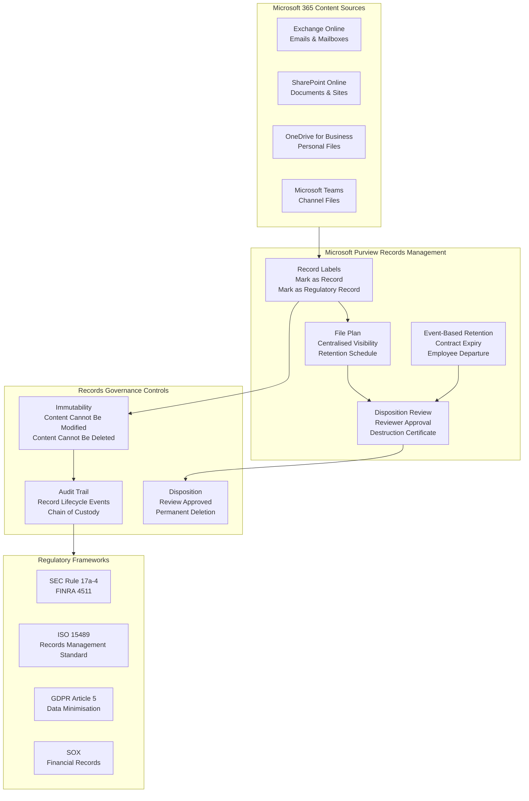
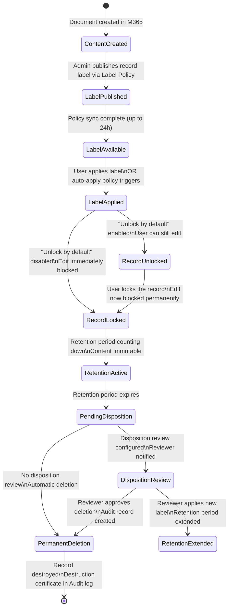
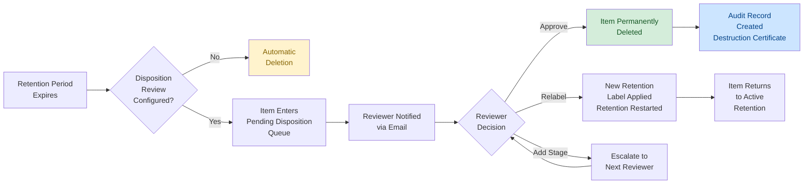
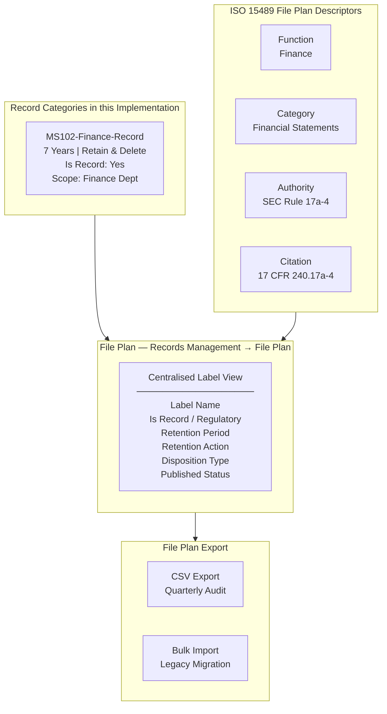

# Records Management Architecture

## Diagram 1 — Enterprise Records Management Architecture



---

## Diagram 2 — Record Label Lifecycle



---

## Diagram 3 — Disposition Review Workflow



---

## Diagram 4 — File Plan Architecture



---

## Technology Stack

| Layer | Component | Purpose |
|---|---|---|
| Compliance Portal | compliance.microsoft.com | Administration and configuration |
| Records Management | Microsoft Purview Records Management | Record declaration, File Plan, Disposition |
| Data Lifecycle | Microsoft Purview DLM | Retention labels, label policies |
| Workloads | Exchange Online, SharePoint Online, OneDrive, Teams | Content locations |
| Automation | Security & Compliance PowerShell | Reporting and audit |
| Audit | Microsoft Purview Audit | Record lifecycle event logging |
| Identity | Microsoft Entra ID | Role-based access control |

---

## Records Management Portal Navigation

```
compliance.microsoft.com
└── Solutions
    ├── Data Lifecycle Management
    │   ├── Retention Labels          ← Create and configure record labels
    │   └── Label Policies            ← Publish labels to workloads
    └── Records Management
        ├── Overview
        ├── File Plan                 ← Centralised label visibility
        ├── Events                    ← Create event-based retention triggers
        └── Disposition               ← Review and approve pending dispositions
```
