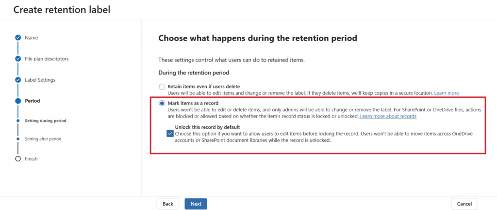
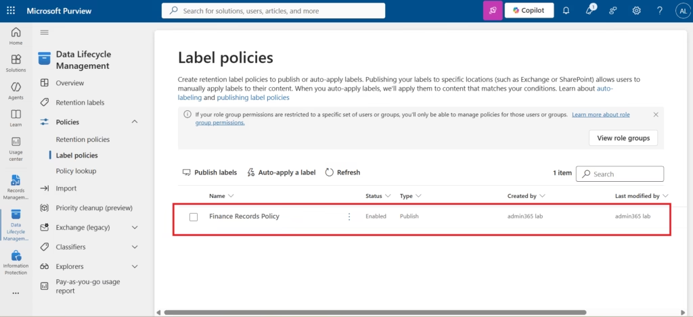

# Record Labels

## What Is a Record Label?

A Record Label is a Microsoft Purview retention label configured with record declaration settings. When applied to content in Microsoft 365, a Record Label:

- Declares the content as an official business record
- Prevents users from editing or deleting the content
- Enforces the configured retention period
- Creates an audit trail for all record lifecycle events
- Makes the content visible in the Records Management File Plan

Record Labels are created in Data Lifecycle Management and managed through the Records Management solution.

---

## Record Label vs Standard Retention Label

| Property | Retention Label | Record Label |
|---|---|---|
| Retention period | ✅ | ✅ |
| Deletion at period end | ✅ | ✅ |
| Declare as record | ❌ | ✅ |
| Prevent user edits | ❌ | ✅ (when locked) |
| Prevent user deletion | ❌ | ✅ |
| Appears in File Plan | ❌ | ✅ |
| Disposition review support | Optional | Full |
| Audit events generated | Basic | Full record lifecycle |

---

## Lab Configuration: MS102-Finance-Record

### Label Specification

| Setting | Value |
|---|---|
| Label name | MS102-Finance-Record |
| Retention period | 7 years |
| Retention action | Retain and delete |
| Record type | Record (unlocked by default) |
| Scope | Finance team (adaptive scope) |
| Workloads | Exchange Online, SharePoint Online, OneDrive |

### Step-by-Step Implementation

#### Step 1 — Navigate to Data Lifecycle Management
```
compliance.microsoft.com → Solutions → Data Lifecycle Management → Retention Labels
```

#### Step 2 — Create a New Label
Select **Create a label**. Configure:

- **Name:** `MS102-Finance-Record`
- **Description for admins:** Finance records — 7-year retention with record declaration
- **Description for users:** Apply to financial records, budget documents, and audit reports

#### Step 3 — Configure Retention Settings
- **Retain items for:** 7 years
- **Based on:** When items were created
- **After the retention period:** Delete items automatically

#### Step 4 — Enable Record Declaration

On the **Define record management settings** page, select:

> **Mark items as a record**

This setting converts the retention label into a Record Label, enabling Microsoft Purview Records Management capabilities.


*Appendix A.1 — Record declaration configuration — "Mark items as a record" setting in label wizard*

**Optional: Unlock this record by default**

Select this option to allow users to edit content after the label is applied. Users can then lock the record manually when the document is finalised. This is recommended for content that goes through a drafting and review process before becoming an official record.

If this option is not selected, the record is locked immediately upon label application — no further edits are possible.

#### Step 5 — Review and Create
Review all settings, then select **Create label**.

#### Step 6 — Publish the Label
Navigate to:
```
Data Lifecycle Management → Label Policies → Publish labels
```

Configure:
- **Labels to publish:** MS102-Finance-Record
- **Users and groups:** Finance team (adaptive scope — Department = Finance) or All users
- **Mandatory labelling:** Optional for record labels; recommended for financial content


*Appendix A.3 — Label policies page — MS102-Finance-Record published to Finance workloads*

---

## Record Lock States

Record Labels support two lock states, depending on the configuration:

| State | Description | User Can Edit | User Can Delete |
|---|---|---|---|
| **Unlocked** | Record declared but not locked | Yes | No |
| **Locked** | Record formally locked | No | No |

When "Unlock this record by default" is selected, content starts in the Unlocked state and users can transition it to Locked. When not selected, content is immediately Locked upon label application.

---

## Record Label Behaviour by Workload

| Workload | Behaviour When Record Label Applied |
|---|---|
| SharePoint Online | Item versioning enforced; edit/delete blocked for locked records |
| Exchange Online | Email declared as record; no recall or deletion by user |
| OneDrive | File versioning enforced; deletion blocked |
| Microsoft Teams | File attachments in Teams channels are protected via SharePoint |

---

## Audit Events for Record Labels

Record lifecycle events are captured in Microsoft Purview Audit:

| Event | Audit Activity |
|---|---|
| Label applied | RecordsManagementLabelApplied |
| Record locked | RecordsManagementRecordLocked |
| Disposition approved | RecordsManagementDispositionApproved |
| Disposition rejected | RecordsManagementDispositionRejected |
| Label removed (admin) | RecordsManagementLabelRemoved |

---

## MS-102 Exam Guidance

**Scenario:** An organisation must prevent users from deleting financial documents during a 7-year retention period.

**Correct answer:** Record Label with "Mark items as a record" enabled.

**Key distinctions:**
- Standard Retention Label — retains content but does not prevent user editing or deletion
- Record Label — retains content AND prevents user editing/deletion
- Regulatory Record — highest protection; even admins cannot remove the label

---

## Related Documentation

- [01 — Overview](01-overview.md)
- [03 — File Plan](03-file-plan.md)
- [06 — Regulatory Records](06-regulatory-records.md)
- [07 — Validation](07-validation.md)

---

*Record label configuration documented from the Patchthecloud.onmicrosoft.com lab tenant. No configurations have been fabricated.*
