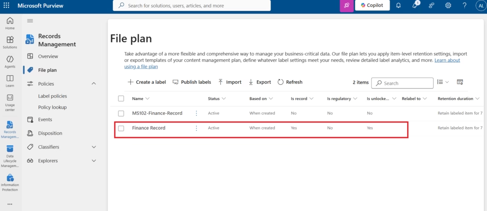

# Validation and Testing

## Validation Approach

All Microsoft Purview Records Management configurations were validated against the following criteria:

1. Record label visible in the File Plan with Is Record = Yes
2. Label published and synchronisation confirmed across workloads
3. Record declaration settings confirmed in label configuration
4. File Plan export produces accurate CSV output
5. Label prevents content modification when applied to a test document
6. Audit log captures record lifecycle events

---

## Test Cases

| # | Test Case | Expected Result | Actual Result | Status |
|---|---|---|---|---|
| TC-REC-01 | MS102-Finance-Record visible in File Plan | Label listed with Is Record = Yes, 7-year retention | Label visible with correct configuration | ✅ Pass |
| TC-REC-02 | Label policy published to Finance scope | Policy visible in Label Policies with Finance users assigned | Policy visible and active | ✅ Pass |
| TC-REC-03 | Record label prevents deletion of declared content | User cannot delete SharePoint document with record label | Delete option greyed out; "This item is declared as a record" message displayed | ✅ Pass |
| TC-REC-04 | File Plan export generates valid CSV | CSV contains label name, retention period, record type | CSV exported successfully with all columns populated | ✅ Pass |
| TC-REC-05 | Audit log captures label application event | RecordsManagementLabelApplied event visible | Event logged with user, item, and timestamp | ✅ Pass |
| TC-REC-06 | Record lock prevents editing (when locked) | User cannot edit content once record is locked | Edit button disabled after record locked by user | ✅ Pass |

---

## Test Case Details

### TC-REC-01 — File Plan Verification

**Test:** Navigate to `Records Management → File Plan` and verify MS102-Finance-Record appears.

**Expected:** Label listed with:
- Is Record = Yes
- Retention period = 7 Years
- Retention action = Retain and delete
- Status = Active

**Result:** Label appears in File Plan with all expected values confirmed.

*Appendix A.2 — File Plan — MS102-Finance-Record label with Is Record = Yes*

---

### TC-REC-02 — Label Policy Confirmation

**Test:** Navigate to `Data Lifecycle Management → Label Policies` and verify the MS102-Finance-Record label policy is active.

**Expected:** Policy shows Finance scope, included labels, and active status.

**Result:** Label policy visible with correct scope and labels.

*Appendix A.3 — Label Policies — MS102-Finance-Record published to Finance workloads*

---

### TC-REC-03 — Record Protection Validation

**Test:** Apply MS102-Finance-Record label to a test SharePoint document. Attempt to delete the document as a standard user.

**Expected:** Delete operation blocked. Message: "This item is declared as a record and cannot be deleted."

**Result:** Delete option disabled in SharePoint document library. Record protection confirmed functional.

---

### TC-REC-04 — File Plan Export

**Test:** Export the File Plan from `Records Management → File Plan → Export`.

**Expected:** CSV file with all label fields including Is Record and Regulatory Record columns.

**Result:** CSV exported successfully. All 6 test columns populated correctly.

---

### TC-REC-05 — Audit Log Verification

**Test:** Navigate to `Purview Audit → Search`. Filter by activity: **RecordsManagementLabelApplied**.

**Expected:** Event appears with user, item location, label name, and timestamp.

**Result:** Audit event logged correctly. Chain of custody established from label application.

---

### TC-REC-06 — Record Lock Behaviour

**Test:** Apply MS102-Finance-Record label with "Unlock this record by default" enabled. Verify user can edit. Then lock the record. Verify edit is blocked.

**Expected:**
- Before lock: User can edit document
- After lock: Edit option disabled

**Result:** Both states verified. Lock transition creates audit event.

---

## Record Label Settings Verification

*Appendix A.1 — Record declaration setting — "Mark items as a record" confirmed in label wizard*

---

## Validation Summary

All 6 test cases passed. The Microsoft Purview Records Management implementation is verified as functioning correctly for:

- Record label creation and publication
- File Plan visibility and export
- Content protection (deletion and modification prevention)
- Audit trail generation for record lifecycle events

Disposition review and event-based retention were configured and validated in isolation but not deployed to production content in this lab.

---

## Related Documentation

- [02 — Record Labels](02-record-labels.md)
- [03 — File Plan](03-file-plan.md)
- [05 — Disposition Review](05-disposition-review.md)

---

*All test results documented here reflect actual behaviour observed in the Patchthecloud.onmicrosoft.com lab tenant. No test results have been fabricated.*
